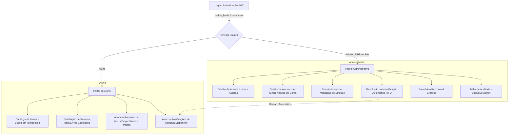
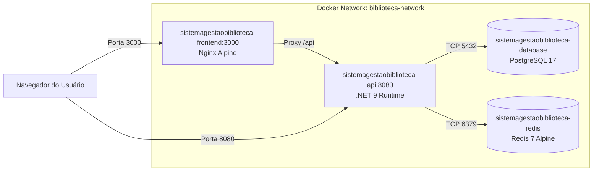

# 📚 SmartLib — Sistema de Gestão de Biblioteca Universitária

---

## 1. 🎯 Sobre o Projeto e sua Importância

### 1.1. O que é o SmartLib?
O **SmartLib** é uma plataforma corporativa completa desenvolvida para modernizar, automatizar e centralizar a gestão de bibliotecas universitárias e centros acadêmicos. O sistema atende tanto ao corpo operacional (administradores e bibliotecários) quanto à comunidade discente (alunos), promovendo um fluxo transparente e ágil para circulação de acervos físicos e digitais.

### 1.2. Qual a sua Importância?
Em instituições de ensino superior, bibliotecas lidam diariamente com desafios operacionais e pedagógicos:
- **Rastreabilidade e Proteção do Patrimônio:** Elimina perdas e extravios com o registro rigoroso de empréstimos, devoluções e históricos de cada exemplar.
- **Democratização e Fila de Espera Justa (FIFO Estrito):** Livros de alta demanda contam com uma fila de reserva automática ordenada por tempo de solicitação (*First-In, First-Out*). No instante em que um exemplar é devolvido, o próximo estudante da fila é notificado automaticamente.
- **Inadimplência e Disciplina de Devolução:** Cálculo automatizado e transparente de penalidades financeiras (R$ 2,00 por dia de atraso), estimulando a devolução pontual.
- **Decisões Estratégicas Orientadas a Dados:** Painel analítico (*Business Intelligence*) com 4 gráficos interativos em tempo real que revelam livros mais populares, categorias mais demandadas, histórico mensal e taxa de pontualidade.
- **Auditoria e Conformidade (Compliance):** Registro automático de logs para cada operação de criação, edição ou exclusão, vinculando a ação à identidade e data/hora da operação.

---

## 2. 🔄 Fluxo da Aplicação

O ecossistema SmartLib funciona por meio de fluxos integrados e orientados a eventos de negócio:



### Detalhamento dos Principais Fluxos:

1. **Fluxo de Autenticação e Autorização (RBAC):**
   - Usuário submete credenciais para `POST /api/auth/login`.
   - A API valida a senha com **BCrypt**, extrai o perfil (`Admin`, `Bibliotecario` ou `Aluno`) e o identificador do aluno (`AlunoId`), gerando um token **JWT** criptografado com validade de 8 horas.
   - O frontend armazena o token de sessão e direciona o usuário para `admin.html` ou `usuario.html`.

2. **Fluxo de Cadastro de Aluno com Auto-Provisionamento:**
   - Ao cadastrar um aluno (`POST /api/alunos`), o sistema automaticamente gera a conta de acesso correspondente na tabela de `Usuarios` com o perfil `Aluno` e senha padrão (`Aluno@123`). O aluno já pode efetuar login imediatamente.

3. **Fluxo de Empréstimo:**
   - O bibliotecário seleciona aluno, livro e datas (`DataEmprestimo` e `DataPrevistaDevolucao`).
   - O sistema valida:
     - Existência de exemplares físicos disponíveis (`Quantidade > 0`).
     - Inexistência de empréstimo ativo prévio do mesmo livro pelo mesmo aluno.
   - O exemplar é decrementado do acervo e o cache de livros populares no Redis é invalidado de forma reativa.

4. **Fluxo de Devolução e Notificação Reativa (FIFO Estrito):**
   - Quando um livro é devolvido (`POST /api/emprestimos/devolver` ou `PUT /api/emprestimos/{id}/devolucao`):
     1. O status do empréstimo passa para `Devolvido` e a data de entrega é registrada.
     2. A quantidade do livro é recomposta no estoque.
     3. O **NotificationService** consulta a fila de reservas daquele livro específico (`Status == 'Pendente'`), ordenada cronologicamente (`OrderBy(r => r.DataReserva)`).
     4. A reserva do próximo da fila é alterada para `Atendida` e um registro é gravado na tabela `Notificacoes`.
     5. No portal do aluno, surge imediatamente o badge e a mensagem informando que o exemplar reservado já se encontra disponível para retirada no balcão.

---

## 3. 🏗️ Arquitetura do Sistema

O SmartLib segue uma arquitetura em camadas desacopladas (**Layered Architecture**) com injeção de dependência e inversão de controle:

```
├── Presentation Layer
│   ├── Frontend SPA (HTML5, Vanilla CSS Glassmorphism, JS modular)
│   └── API Controllers (Endpoints RESTful com Swagger/OpenAPI)
├── Business Logic Layer (Services)
│   ├── AlunoService, AutorService, LivroService
│   ├── EmprestimoService (Regras de disponibilidade e multas)
│   ├── NotificationService (Regra FIFO de fila de reservas)
│   ├── DashboardService (Métricas e Cache-Aside)
│   └── AuditoriaService (Registro automático de rastreabilidade)
├── Data Access Layer (Repositories & EF Core)
│   ├── IAlunoRepository, ILivroRepository, IEmprestimoRepository...
│   └── BibliotecaDbContext (Mapeamento relacional com PostgreSQL)
├── Cross-Cutting & Infrastructure
│   ├── Redis Distributed Cache (Cache-Aside Pattern)
│   ├── Deep Health Checks (PostgreSQL e Redis físicos)
│   ├── Global Error Handling Middleware (RFC 7807 ProblemDetails)
│   └── JWT Authentication Middleware
```

### Padrões de Projeto Aplicados:
- **Repository Pattern:** Encapsula consultas e comandos de persistência, isolando a regra de negócio de detalhes de banco.
- **DTO Pattern (Data Transfer Object):** Evita over-posting, protege propriedades sensíveis (como hashes de senhas) e previne ciclos de serialização JSON.
- **Cache-Aside Pattern:** O serviço consulta o Redis primeiro; havendo *miss*, busca no PostgreSQL, grava no cache com TTL de 30 minutos e retorna. Qualquer escrita invalida o cache para manter consistência eventual.
- **Defensive Timezone Handling:** Normalização de instâncias `DateTime` para `DateTimeKind.Utc` no backend e formatação defensiva no frontend, prevenindo desvios de datas causados por fusos horários ocidentais (UTC-3).

---

## 4. 💻 Stacks do Sistema

| Camada | Tecnologia / Ferramenta | Detalhes Técnicos |
|:---|:---|:---|
| **Backend** | .NET 9 / C# 12 | ASP.NET Core Web API com injeção de dependências nativa |
| **Banco de Dados** | PostgreSQL 17 | Persistência relacional robusta com chaves estrangeiras e índices únicos |
| **ORM** | Entity Framework Core 10 | Code-First com Migrations automatizadas no startup da API |
| **Cache Distribuído** | Redis 7 (Alpine) | Armazenamento chave-valor em memória para otimização de leituras |
| **Frontend** | HTML5 / Vanilla CSS / JavaScript | Single Page Application estilizada com design Glassmorphism e CSS moderno sem frameworks pesados |
| **Data Visualization** | Chart.js 4.4 | Gráficos interativos com animações e temas escuros coerentes com a UI |
| **Autenticação** | JWT (JSON Web Tokens) + BCrypt | Assinatura HMAC-SHA256 e hash de senha com salt aleatório |
| **Observabilidade** | ASP.NET Core Health Checks | Monitoramento deep de conectividade física com Postgres e ping no Redis |
| **Testes Automatizados** | xUnit + Moq | 18 testes unitários cobrindo serviços, regras de negócio e validações |
| **Containerização** | Docker & Docker Compose | Multi-container com redes internas isoladas e volumes persistentes |
| **Web Server / Reverse Proxy** | Nginx Alpine | Servidor web otimizado para arquivos estáticos e proxying da API |

---

## 5. 📊 Relatórios e Visualização de Dados (Gráficos)

O SmartLib conta com um subsistema analítico de Business Intelligence voltado para os gestores da biblioteca, alimentado pelo `DashboardService`:

```
┌─────────────────────────────────────────────────────────────────────────────┐
│                            PAINEL DE MÉTRICAS                               │
├──────────────────────┬──────────────────────┬───────────────────────────────┤
│ 📚 Livros Populares  │ 🏷️ Distribuição por  │ 📈 Evolução por Mês          │
│ (Barra Horizontal)   │    Categorias        │    (Linha com Gradiente)      │
│ Top 10 mais lidos    │ (Gráfico Polar/Donut)│ Histórico dos últimos 6 meses │
├──────────────────────┴──────────────────────┴───────────────────────────────┤
│ 🍩 Status Geral de Empréstimos e Atrasos (Donut Chart)                      │
│ [ No Prazo: Verde ]      [ Atrasados: Vermelho ]      [ Devolvidos: Roxo ]  │
├─────────────────────────────────────────────────────────────────────────────┤
│ 🚨 Tabela de Inadimplência em Tempo Real                                    │
│ Aluno | E-mail | Livro | Data Prevista | Dias de Atraso | Multa Calculada   │
└─────────────────────────────────────────────────────────────────────────────┘
```

1. **Livros Mais Populares (Bar Chart Horizontal):**
   - Agrupa empréstimos históricos por título de livro em ordem decrescente (`Top 10`).
   - Servido via **Redis** com estratégia Cache-Aside para evitar consultas pesadas de agregação no banco de dados.
2. **Distribuição por Categorias (Doughnut / Polar Area):**
   - Demonstra visualmente o equilíbrio do acervo entre áreas do conhecimento (Ex: Computação, Fantasia, Engenharia, Medicina).
3. **Evolução de Empréstimos por Mês (Line Chart com Fill):**
   - Apresenta o volume histórico dos últimos 6 meses, permitindo identificar tendências sazonais de leitura.
4. **Status de Empréstimos e Atrasos (Doughnut Chart):**
   - Compara em tempo real a proporção entre empréstimos devolvidos, empréstimos ativos no prazo e empréstimos em atraso.
5. **Cálculo Automático de Multas e Atrasos:**
   - O sistema calcula a diferença em dias entre a data prevista e o instante atual (`DateTime.UtcNow`). Se houver atraso, calcula `dias * R$ 2,00` e destaca os valores em vermelho tanto no painel administrativo quanto no extrato do aluno.

---

## 6. 🐳 Dockerização e Versionamento

### 6.1. Infraestrutura Docker
O projeto é completamente executável em qualquer ambiente por meio do Docker Compose:



- **Isolamento e Segurança:** Banco de dados e Redis residem na rede interna `biblioteca-network` sem exposição desnecessária de portas públicas do banco.
- **Orquestração com Healthcheck:** A API só inicia após o PostgreSQL responder positivamente ao teste de conexão (`pg_isready`) e o Redis responder a `redis-cli ping`.
- **Persistência de Dados:** O volume `postgres_data` garante que cadastros de alunos, livros e empréstimos permaneçam salvos mesmo após reiniciar ou recriar os containers.
- **Multi-Stage Build no Backend:**
  - Estágio 1 (`build`): SDK completo do .NET para restauração de dependências, compilação e publicação em modo `Release`.
  - Estágio 2 (`runtime`): Imagem enxuta `aspnet:10.0` apenas com o runtime, reduzindo drasticamente o tamanho final da imagem e aumentando a segurança.

### 6.2. Estratégia de Versionamento Git
O repositório adota rastreabilidade rigorosa por branch:
- `main`: Branch estável para homologação final.
- `Projeto_Integrador`: Branch de integração de funcionalidades do projeto acadêmico.
- `Corrigindo_Erros_Aluno`: Branch dedicada à correção dos fluxos de visualização de empréstimos, gestão de alunos e alinhamento de fuso horário.
- Cada entrega é acompanhada de commits semânticos e mensagens claras que explicam o motivo de cada alteração de código.

---

## 7. 🔌 Principais Endpoints da API

Abaixo está o catálogo dos principais endpoints RESTful disponibilizados pelo backend:

### 7.1. Autenticação (`/api/auth`)
| Método | Endpoint | Perfil Permitido | Descrição |
|:---|:---|:---|:---|
| `POST` | `/api/auth/login` | Público | Autentica e retorna Token JWT, Perfil e Vínculo de Aluno |

### 7.2. Livros (`/api/livros`)
| Método | Endpoint | Perfil Permitido | Descrição |
|:---|:---|:---|:---|
| `GET` | `/api/livros` | Público | Consulta paginada com busca por título, autor ou categoria |
| `GET` | `/api/livros/populares` | Público | Retorna os 10 livros mais emprestados (otimizado via Redis) |
| `GET` | `/api/livros/{id}` | Público | Obtém os detalhes completos dos 9 atributos de um livro |
| `POST` | `/api/livros` | Admin, Bibliotecário | Cadastra um novo livro no acervo |
| `PUT` | `/api/livros/{id}` | Admin, Bibliotecário | Atualiza dados e quantidade em estoque |
| `DELETE` | `/api/livros/{id}` | Admin | Exclui um livro do acervo |

### 7.3. Empréstimos (`/api/emprestimos`)
| Método | Endpoint | Perfil Permitido | Descrição |
|:---|:---|:---|:---|
| `POST` | `/api/emprestimos` | Admin, Bibliotecário | Realiza novo empréstimo com validação de estoque |
| `GET` | `/api/emprestimos` | Admin, Bibliotecário | Lista todos os empréstimos registrados |
| `GET` | `/api/emprestimos/abertos` | Admin, Bibliotecário | Filtra apenas os empréstimos ativos pendentes de devolução |
| `GET` | `/api/emprestimos/aluno/{alunoId}` | Admin, Bibliotecário, Aluno | Extrato de empréstimos do aluno com multas e datas |
| `POST` | `/api/emprestimos/devolver` | Admin, Bibliotecário | Devolução oficial que dispara notificação FIFO de reserva |
| `PUT` | `/api/emprestimos/{id}/devolucao` | Admin, Bibliotecário | Devolução via ID direto (compatibilidade frontend) |

### 7.4. Reservas (`/api/reservas`)
| Método | Endpoint | Perfil Permitido | Descrição |
|:---|:---|:---|:---|
| `POST` | `/api/reservas` | Admin, Bibliotecário, Aluno | Entra na fila de reserva (permitido apenas para livros esgotados) |
| `GET` | `/api/reservas/fila/{livroId}` | Admin, Bibliotecário | Visualiza a ordem cronológica da fila de espera do livro |
| `GET` | `/api/reservas/aluno/{alunoId}` | Admin, Bibliotecário, Aluno | Lista as reservas feitas pelo aluno logado |

### 7.5. Notificações (`/api/notificacoes`)
| Método | Endpoint | Perfil Permitido | Descrição |
|:---|:---|:---|:---|
| `GET` | `/api/notificacoes/aluno/{alunoId}` | Aluno, Admin | Consulta as notificações geradas automaticamente para o aluno |
| `PUT` | `/api/notificacoes/{id}/lida` | Aluno, Admin | Marca a notificação como visualizada pelo estudante |

### 7.6. Alunos (`/api/alunos`)
| Método | Endpoint | Perfil Permitido | Descrição |
|:---|:---|:---|:---|
| `GET` | `/api/alunos` | Admin, Bibliotecário | Lista todos os alunos cadastrados com matrícula e e-mail |
| `POST` | `/api/alunos` | Admin, Bibliotecário | Cadastra aluno e cria automaticamente usuário de acesso |
| `PUT` | `/api/alunos/{id}` | Admin, Bibliotecário | Atualiza dados cadastrais e sincroniza conta de acesso |
| `DELETE` | `/api/alunos/{id}` | Admin | Exclui aluno e sua conta (bloqueado se houver pendências) |

### 7.7. Autores (`/api/autores`)
| Método | Endpoint | Perfil Permitido | Descrição |
|:---|:---|:---|:---|
| `GET` | `/api/autores` | Público | Lista todos os autores cadastrados |
| `POST` | `/api/autores` | Admin, Bibliotecário | Cadastra novo autor com conversão de data UTC |
| `PUT` | `/api/autores/{id}` | Admin, Bibliotecário | Atualiza informações biográficas do autor |
| `DELETE` | `/api/autores/{id}` | Admin | Exclui autor cadastrado |

### 7.8. Relatórios e Auditoria
| Método | Endpoint | Perfil Permitido | Descrição |
|:---|:---|:---|:---|
| `GET` | `/api/relatorios/dashboard` | Admin, Bibliotecário | Agregação completa para alimentação dos 4 gráficos |
| `GET` | `/api/auditoria` | Admin | Trilha de auditoria paginada com filtro de ações críticas |

### 7.9. Observabilidade & Saúde (`/health`)
| Método | Endpoint | Perfil Permitido | Descrição |
|:---|:---|:---|:---|
| `GET` | `/health` | Público | Deep Health Check testando conectividade real com Postgres e Redis |

---

## 8. 🚀 Como Executar o Sistema

```bash
# 1. Clonar o repositório
git clone https://github.com/Caioxlw/SistemaGestaoBiblioteca.git
cd SistemaGestaoBiblioteca

# 2. Subir todos os serviços via Docker Compose
docker compose up -d --build

# 3. Acessar a aplicação no navegador
# Frontend: http://localhost:3000
# Documentação Swagger da API: http://localhost:8080/swagger
# Health Check do Sistema: http://localhost:8080/health
```

### Contas Pré-Configuradas para Demonstração:
- **Administrador:** `admin@smartlib.com` / `Admin@123` (Acesso total + Auditoria)
- **Bibliotecário:** `biblio@smartlib.com` / `Biblio@123` (Operações de acervo, alunos e empréstimos)
- **Aluno Exemplo:** `aluno@smartlib.com` / `Aluno@123` (Catálogo, empréstimos, reservas e notificações)
